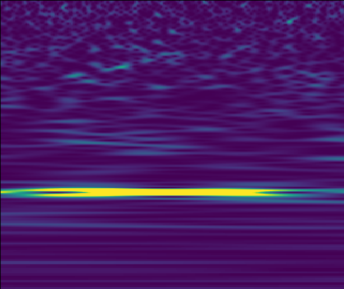

# GravWave-CNN
CNN for classifying Gravitational Wave Signal 

# Gravitational Waves

Gravitational waves originated from energetic processes in universe. In the General Relativity, the massive accelerating objects such as neutron stars, pulsars, or black holes orbiting each other. The motion resulted in space-time disruption and propagate isotrophically from the source. Cosmic ripples travel at the speed of light and hints about the gravity.

A collision of black holes, supernovae, and collision of neutron stars resulted in much stronger gravitational waves. There is a possibility that Gravitational Waves originated from the big bang remnants. 

Here is an example of Gravitational Waves signal candidate, such as a strong power line. The original data actually is on time-series signal. The Y-axis related to frequency, and the X-axis related to time.  

This is an example of data taken from Louisiana interferometer (L1)

# Why CNN?

Determining lines on gravitational waves dataset is a tedious works. The volume of data generated is inhuman. Then, we need machine learning. CNN is a good method to classifying image, thus resulted in adventage on Gravitational Waves data. 

Dataset: https://www.kaggle.com/tentotheminus9/gravity-spy-gravitational-waves (Actually very big)

Sources: 

Gravitational Waves. from https://www.ligo.caltech.edu/page/what-are-gw 

GW190412. from https://www.gw-openscience.org/eventapi/html/O3_Discovery_Papers/GW190412/v1/
